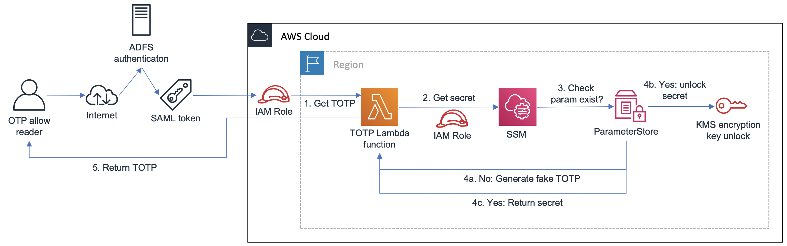

# aws-serverless-otp

This SAM application can create Time-based One Time Passwords (OTP) based on secrets stored in AWS SSM Parameter Store. It will return a bogus OTP if Parameter Store doesn't contain a value for a given key.

The OTP are based on the `gauth` library which provides Google Authenticator compatible OTPs.

Architecture with an example implementation of ADFS for authentication:



## Requirements

* AWS SAM
* Go 1.14
* AWS account with IAM privileges

# Deployment

## Automated steps, build and SAM

There are 3 parameters which Cloudformation uses for deployment:

1. `AllowedIPs`, comma-separated CIDR values for allowed IPs which can invoke the OTP function. Defaults to `0.0.0.0/0,192.168.100.25/32`. **You probably want to change this to something more restrictive.**
2. `ServerlessOTPRoleName`, the name of the role used by the OTP Lambda function. Defaults to `ServerlessOTPRole`
3. `AllowGetOTPRoleName`, the name of the role allowed to invoke the OTP function. Defaults to `AllowGetOTPRole`

```bash
make build
sam deploy --guided \
    --parameter-overrides \
        ParameterKey=AllowedIPs,ParameterValue=0.0.0.0/0,192.168.100.25/32 \
        ParameterKey=ServerlessOTPRoleName,ParameterValue=ServerlessOTPRole \
        ParameterKey=AllowGetOTPRoleName,ParameterValue=AllowGetOTPRole

```
The `--parameter-overrides` flag is optional if you don't want to change the defaults. It's strongly recommended to set a restrictive IP range.

## Manual steps

Stored secrets must be Google Authenticator compliant string.

Secrets must be manually added to SSM Parameter Store. [See the documentation for steps](https://docs.aws.amazon.com/systems-manager/latest/userguide/sysman-paramstore-su-create.html). The OTP function will only have permissions to fetch parameters from the same region (i.e. if the function is deployed in Ireland the parameters must be stored in Ireland region).

It is strongly recommended to store secrets as `SecureString`, this will ensure parameters are encrypted at rest and that IAM users without the permissions are unable to decrypt the secrets. For now, the AWS provided KMS key is used.


# Usage
The function accepts a JSON formatted request using the key "parameterName" with value of the key we're trying to fetch a secret for. Example:

```json
{
    "parameterName": "123456789012"
}
```

It will return a JSON formatted message with the current, previous, and next OTP using the stored parameter secret. Example:

```json
{
    "parameterName":"123456789012",
    "otpChallenges": {
        "curr":"519277",
        "next":"733032",
        "prev":"249516"
    }
}
```

You can use the AWS CLI to invoke the Lambda function and get a response. Note that the `AllowGetOTPRoleName` requires MFA, so you must have [set up your credentials accordingly](https://blog.jayway.com/2017/11/22/aws-cli-mfa/).

Example CLI command:
```bash
aws lambda invoke --function-name ServerlessOTP --payload '{"parameterName":"123456789012"}' /dev/stdout
```

# TODO
* Monitoring alarms of usage
* Customer provided KMS key